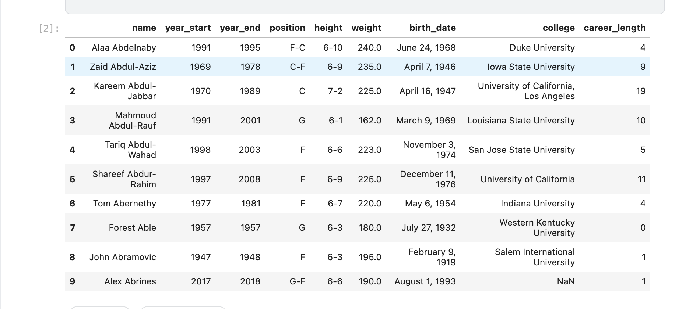
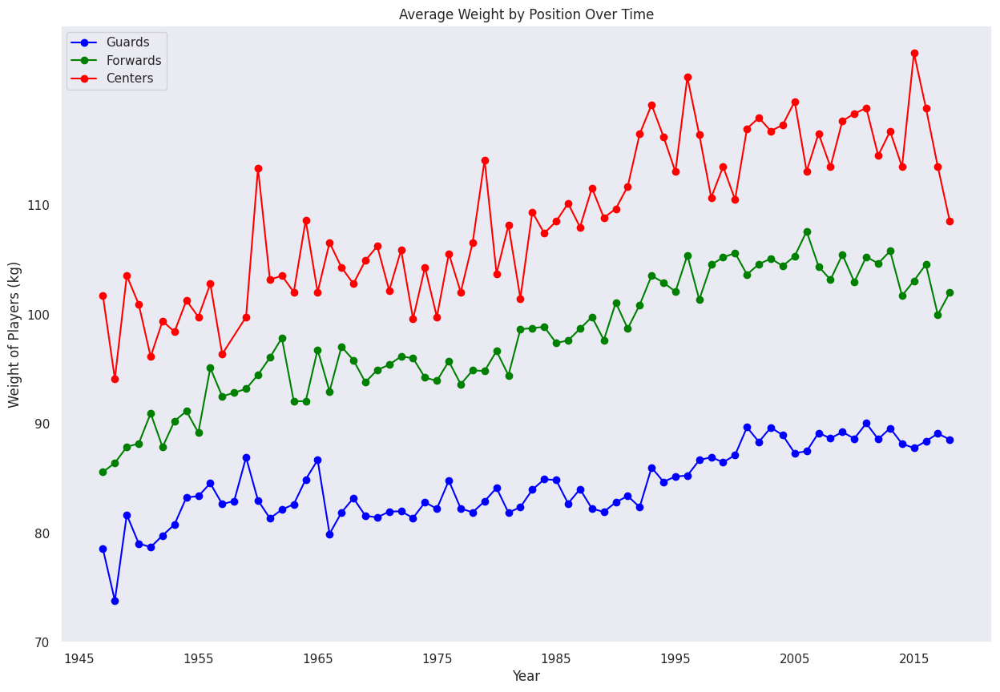
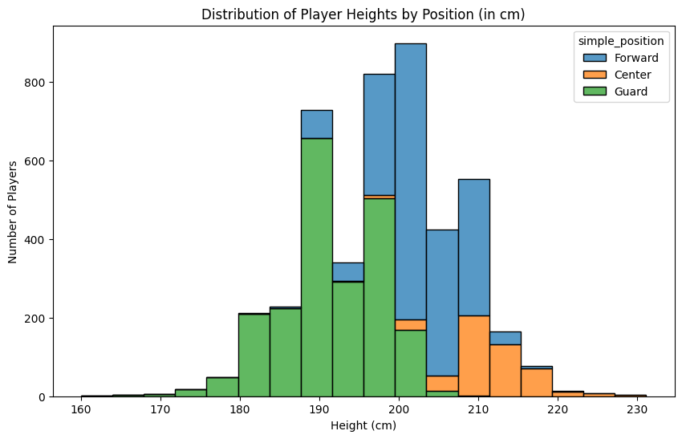
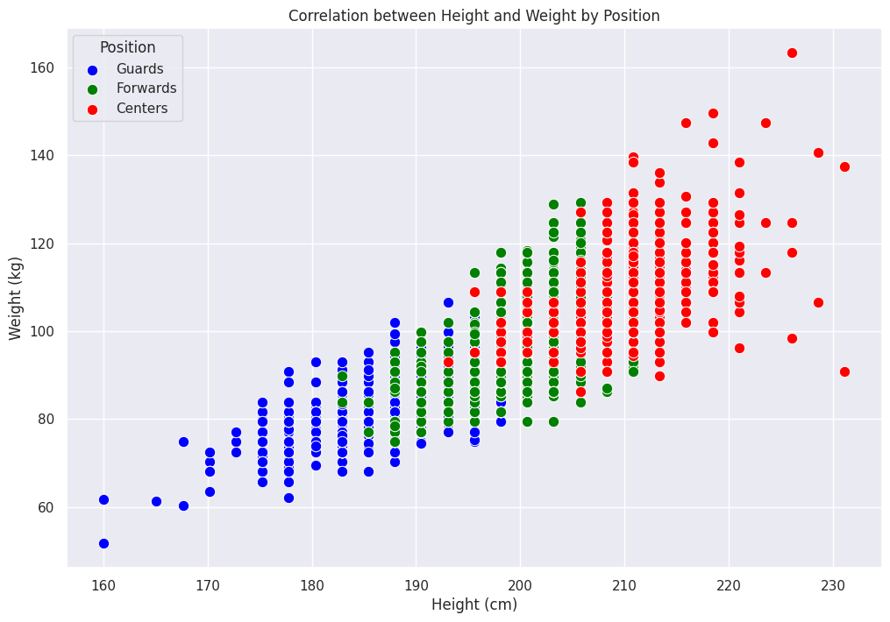

                                   INTRODUCTION TO DATA SCIENCE
                                                            -Lecturer:EMANUELPLAN

                                    REPORT-GROUP 9 :TOPIC BASKETBALL 🏀

    

  Members of group:🎱
                    
                     ĐINH LÂM PHƯƠNG-22080337
  
                     ĐẶNG TRỌNG NAM-22080331
                     
                     NGÔ TIẾN HUY-22080319
                     
                     HOÀNG QUỐC BẢO-22080304
                     
                     HÀ NGỌC ANH-22080294
                     
                     TRẦN KHÁNH LINH-22080324
                

INTRODUCTION 
 
  -The "NBA Player Statistics Since 1950" dataset is sourced from Kaggle, the dataset includes detailed statistical data for NBA players including: player name, starting year, ending year,position, height, weight, date of birth and college the players attended
                                  
 PLAYER SET CREATION

        

    
  name: The name of the player.

  year_start:  The year they began playing in the dataset.
  
  year_end:    The year they stopped playing in the dataset.
  
  position: The positions that players typically occupy 
  
  height: The height of players 

  weight: The weight of players .
  
  birth_date: The birth dates of players
  
  college: Indicates the colleges that players attended

ANALYSIS CONSIDERATIONS📌

-Career longevity: By looking at "#year_start - #year_end", that can analyze trends in player longevity and how it has changed over the years.

-Position trends: The position column allows you to understand how a player's role has evolved in the sport, which can then be used to analyze trends in the average height of each position

-Physical attributes: Height and weight can be analyzed to determine whether there are optimal physical characteristics for specific positions or overall performance.
           
WHAT CLEANING DATA 

Handling Missing Values: Remove or impute missing data in critical columns (like school, position, height, weight, etc.)

Removing Duplicates: Remove any duplicate player records.

Filtering: Select players, or teams relevant to the analysis

   
BASIC ANALYSIS

  The goal is to observe changes in the players over the years from 1947 to   2018

   

Normal distribution: The chart shows a nearly normal (bell-shaped) height distribution of NBA players.

Mean value: The average height of the players is in the range of 195-205cm, which is quite high compared to the average height of adults.

Overall: By visually inspecting the histogram, we can estimate that the mean (average) height of the players is around 200-205 cm. This is based on the peak of the distribution being located within this range.

-Considering Relationships

Height and Frequency: The relationship between height and the number of players is shown by the shape of the histogram. As height increases, the number of players initially increases, reaches a peak, and then decreases

The chart shows that height is an important factor affecting the selection and success of NBA players. However, besides height, other factors such as skill, physical strength, and tactics also play an important role in determining the success of a player.
 
COMPARATIVE ANAYLYSIS 📊

   

Normal distribution chart

The histogram chart analyzes the average height trend of NBA players by position, with the height difference between positions becoming more and more pronounced.

Center: The height distribution graph of the Center is skewed to the right, indicating that most players in this position are above average in height.

Forward: The height distribution graph of the Forward is quite symmetrical, indicating that the height distribution of players in this position is relatively even.

Guard: The height distribution graph of the Guard is skewed to the left, indicating that most players in this position are below average in height.

RELATION OF WEIGHT AND HEIGHT

  

Overall, the graph shows an upward trend from 1950 to 2000.

From the 1950s to the 1970s, there was a general trend of average career length decreasing, from over 4 years to under 4 years.

From the 1970s to the 1990s, we saw greater volatility, with clear peaks and troughs, as the average career length changed from around 3 years to over 6 years.

In the 1990s and 2000s, the average career length seemed more stable, fluctuating between 5-6 years.

Although there were many fluctuations, overall it still clearly shows that the career length of players is increasing over the years, showing that players are sticking with their football team for longer periods of time.

**FINAL THOUGHTS**

 By analyzing this data, one can uncover trends in playing styles, 
individual achievements, and how the league has evolved over time. Whether for academic purposes or fan engagement, the dataset offers
a robust foundation for NBA-related insights.

SOURCES
 
     https://www.kaggle.com/drgilermo/nba-players-stats?select=player_data.csv
   
                  
                                                         
