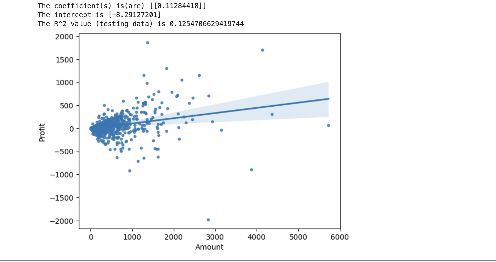

                                   INTRODUCTION TO DATA SCIENCE
                                                            
                                                            -Lecturer:EMANUELPLAN

                                    REPORT-GROUP 9 :ONLINE SALES

    

  Members of group
  
                              |  FULL NAME      | ID number|  
                              |--------------   |----------|
                              | ĐẶNG TRỌNG NAM  | 22080331 | 
                              | ĐINH LÂM PHƯƠNG | 22080337 | 
                              | HÀ NGỌC ANH     | 22080294 | 
                              | TRẦN KHÁNH LINH | 22080324 | 
                              | HOÀNG QUỐC BẢO  | 22080304 | 
                              | NGÔ TIẾN HUY    | 22080319 | 
                  

# 1.INTRODUCTION 
-Online sales is the sale of goods over the Internet, allowing customers to easily purchase and pay securely online without having to visit a store. .In today's digital age, online sales have become an integral part of the goods business landscape. It has a significant impact on consumer behavior and business strategies, as well as the consumer market and most factors related to the goods business. This project explores the complexities of online sales through data visualization, aiming to uncover trends, patterns, and insights of customer that drive successful e-commerce strategies. We aim to answer essential questions related to sales total, customer buying habits, needs, and seasonal order fluctuations.This analysis contributes to businesses' ability to understand their current performance. Additionally, it supports forecasting future trends and making informed decisions and strategic directions for their business.

## 2.DATA SOURCES📌
                     

 

           
## 3.WHAT CLEANING DATA 

-Handling Missing Values: Remove or impute missing data in critical columns (like school, position, height, weight, etc.)

-Removing Duplicates: Remove any duplicate player records.

-Filtering: Select players, or teams relevant to the analysis

# 4.BASIC ANAYLYSIS 📊

###### 5.1. Distribution of state order

  
   

Debit Card:
Observation: Debit Card is moderately popular nowadays but less use than UPI or COD.
Possible Reasons: Some customers do not feel very inclined to use any debit cards because of security issues, hence would rather do UPI or pay cash on delivery.
 UPI is expected to have lower average spending amounts as compared to than Debit Cards even in Categories like Furniture. When UPI limits set are too low, but the cost of the intended purchase can be paid in one sitting then it will be preferred.

###### 5.2.TREND BETW

   

-Normal distribution chart

###### 5.3.DISTRIBUTION OF CATEGORY

  

  -Guards with Outliers: there are a few Guards that are notably heavy for their height. This hints at outliers, however, they might have unique physiques or playing styles. Although 
   some might think this is unusual, it can actually be an advantage. Because of their weight, they can hold their ground better during games, but it's not just about size.
   
###### 5.4.DISTRIBUTION OF SUB-CATEGORY

  

###### 5.5.DISTRIBUTION OF PAYMENT MODE

# 6.CONCLUSION

# 7.REFERENCES
    
     [Github](https://github.com](https://www.kaggle.com/drgilermo/nba-players-stats?select=player_data.csv)
   
                  
                                                         
