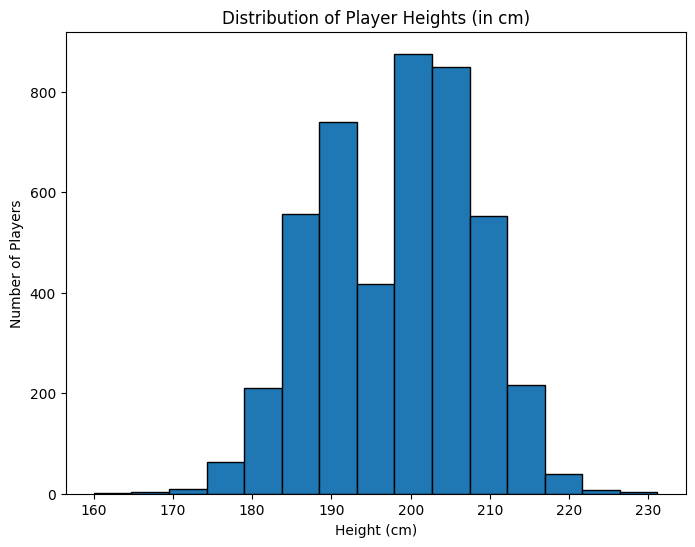

                                   INTRODUCTION TO DATA SCIENCE
                                                            -Lecturer:EMANUELPLAN

                                    REPORT-GROUP 9 :TOPIC BASKETBALL 

    
  

 INTRODUCTION 
 
  -The dataset "NBA Players Stats since 1950" is sourced from Kaggle, a well-known platform for data science competitions and datasets. It contains detailed statistical data for NBA
    players, starting from the 1950s to recent seasons. The dataset includes various player performance metrics like points per game, assists, rebounds, shooting 
    percentages, and more. Its purpose is to provide analysts and researchers with a comprehensive view of player performances across different eras of NBA history, enabling 
    comparisons and trend analysis over time
                                  
PLAYER SET CREATION

        

    
  name: The name of the player.

  year_start: The starting year of the player's career or the year they began playing in the dataset.
  
  year_end: The ending year of the player's career or the year they stopped playing in the dataset.
  
  position: The positions that players typically occupy, with percentages indicating the proportion of players in each position:
  
  height: The height of players, categorized into ranges (e.g., 6-7, 6-8) with the percentage indicating how many players fall into each 
   range.

  weight: The weight of players, possibly indicating distribution across different weight ranges.
  
  birth_date: The birth dates of players, with a histogram showing how many players were born in specific years.
  
  college: Indicates the colleges that players attended, with a percentage showing the proportion of players from a specific college (e.g., 
    University of Kentucky: 7%).
Analysis Considerations
  Career Longevity: By looking at # year_start and # year_end, you can analyze trends in player longevity and how it has changed over the years.
  
  Position Trends: The position column allows for an understanding of how player roles have evolved in the sport, which can influence team dynamics.

  Physical Attributes: Height and weight can be analyzed to determine if there are optimal physical characteristics for specific positions or overall performance.

  Demographic Insights: The birth_date and college columns provide insights into the demographics of the player pool, which can be useful for scouting and recruitment strategies.
  Overall, these columns provide a comprehensive framework for analyzing player statistics and drawing insights into performance, career trends, and team compositions.
           
Q2. What cleaning data:

-Handling Missing Values: Remove or impute missing data in critical columns (like points, assists, rebounds).

-Data Type Conversion: Ensure numeric columns (like points, field goal percentage) are in the correct format.

-Duplicate Removal: Eliminate any duplicate player records.

-Normalization/Standardization: Normalize metrics like points, assists, and rebounds for analysis across different eras.

-Filtering: Select specific seasons, players, or teams relevant to the analysis.

-These steps ensure the dataset is clean, consistent, and ready for meaningful analysis.

HEIGHT ISSUES

   In the dataset, the height information is provided in the format 'feet-inches', where a height of 70 inches would be represented as '6- 
   10', meaning 6 feet 10 inches. Since this format can complicate calculations, I have written the following code to convert these values 
   into the equivalent number of inches.
   
BASIC ANALYSIS

  The goal is to observe changes in the players over the years from 1947 to   2018

   
From the distribution chart of player heights, we can make the following observations:

1. The high concentration of players in the 190-210 cm height range is well-suited for basketball, as this is the typical height range for many successful basketball players. This 
suggests the group likely consists of competitive basketball players.

2. The presence of a significant number of players over 210 cm, up to 230 cm, is advantageous in basketball, as taller players often have advantages in areas like rebounding, blocking 
shots, and scoring in the paint.

3. The very low number of players under 180 cm is also fitting for basketball, as shorter players can face more challenges competing at the highest levels of the sport against taller 
opponents.

4. The normal distribution pattern indicates a balanced mix of player heights, which is typical of a healthy, well-rounded basketball team or talent pool, rather than an outlier group 
skewed heavily towards only the tallest or shortest players.

Overall, the height distribution shown aligns well with the physical requirements and player profiles found in high-level competitive basketball, suggesting this data likely represents 
a group of elite basketball players or prospects.
 
 COMPARATIVE ANAYLYSIS          
        
    

Based on the chart showing the average height by position over time in the NBA, we can make the following observations:
1. The average height of the different positions has seen notable changes over the time periods:
-The average height of the larger positions (center and forward) has trended upwards from the 1950s to the present.
-The average height of the guard position has fluctuated less, but also shows a slight upward trend.
2. The height differential between the positions has also been increasing over time:
-From around 15-20 cm in the 1950s, the height gap has widened to 20-30 cm by 2015.
-The center and forward positions have become increasingly taller compared to the guard position.
3. The fluctuations in average height across the positions have been relatively stable, without any sudden dramatic changes.

Overall, the chart reflects the changing structure of average heights by position in the NBA over time, with the height differential between the positions becoming more pronounced.

 LONGEVITY 
   
   Lastly let's attempt to get a sense of whether players who come into the NBA today are staying longer, or exiting quicker than those of  
   
  the 70s to 90s era. To do this however, we must omit players who are still playing, as they do not have a year_end date

  

Based on the chart showing the average career length of NBA players, we can make the following observations:
1. There is significant variability in the average career length of NBA players over time, ranging from around 2 years to nearly 7 years.

2. From the 1950s to the 1970s, there is a general declining trend in average career length, from over 4 years down to below 4 years.

3. From the 1970s to the 1990s, we see greater fluctuations, with clear peaks and valleys, as the average career length changes from around 3 years up to over 6 years.

4. In the 1990s and 2000s, the average career length appears to stabilize more, oscillating around the 5-6 year range.

Overall, the chart reflects substantial changes in the average NBA player career length over time, with notable ups and downs.

**FINAL THOUGHTS**

This dataset serves as a rich resource for sports analysts, researchers, and basketball enthusiasts. Its breadth and depth allow for deep

dives into player performances and the changing dynamics of the NBA. By analyzing this data, one can uncover trends in playing styles, 

individual achievements, and how the league has evolved over time. Whether for academic purposes or fan engagement, the dataset offers a 

robust foundation for NBA-related insights.

SOURCES
 
     https://www.kaggle.com/drgilermo/nba-players-stats?select=player_data.csv
   
                  
                                                         
