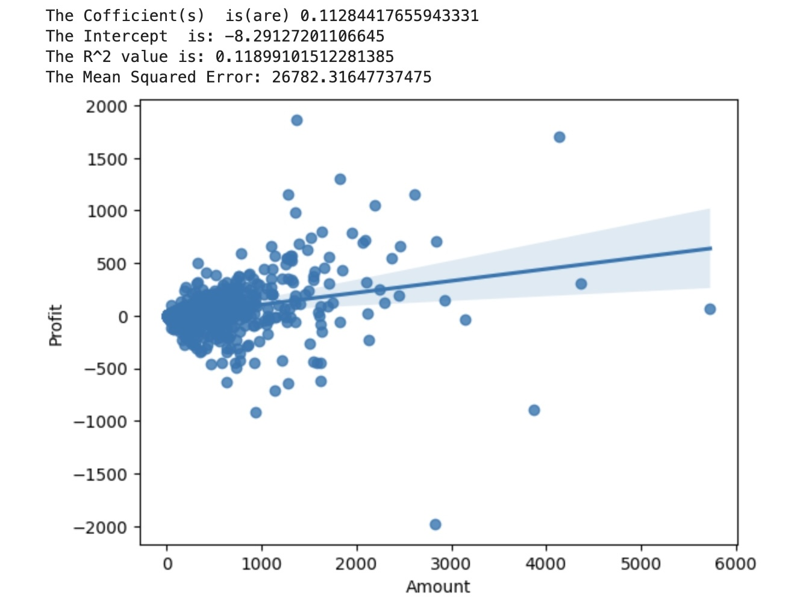

                       INTRODUCTION TO DATA SCIENCE
                                                                                                        
                                           -Lecturer:EMANUELPLAN
                                                                             
                        REPORT-GROUP 9 : ONLINE SALES

    

  Members of group
  
                              |  FULL NAME      | ID number|  
                              |--------------   |----------|
                              | ĐẶNG TRỌNG NAM  | 22080331 | 
                              | ĐINH LÂM PHƯƠNG | 22080337 | 
                              | HÀ NGỌC ANH     | 22080294 | 
                              | TRẦN KHÁNH LINH | 22080324 | 
                              | HOÀNG QUỐC BẢO  | 22080304 | 
                              | NGÔ TIẾN HUY    | 22080319 | 
                  

# 1.INTRODUCTION 
-Online sales is the sale of goods over the Internet, allowing customers to easily purchase and pay securely online without having to visit a store. .In today's digital age, online sales have become an integral part of the goods business landscape. It has a significant impact on consumer behavior and business strategies, as well as the consumer market and most factors related to the goods business. This project explores the complexities of online sales through data visualization, aiming to uncover trends, patterns, and insights of customer that drive successful e-commerce strategies. We aim to answer essential questions related to sales total, customer buying habits, needs, and seasonal order fluctuations.
This analysis contributes to businesses ability to understand their current performance. Additionally, it supports forecasting future trends and making informed decisions and strategic directions for their business.

## 2.DATA SOURCES📌

                     

 

-Order ID : To connect data between two tables,can know number of order

-Amount and Profit: Analyze revenue and profit.

-Order Date: Look at trends over time.

-State and City: Analyze by region.

-Category and Sub-Category: Analyze by product type

-Paymentmode: Commonly used payment method
           
## 3.WHAT CLEANING DATA 

-Date Formatting: Convert the Order Date column to a datetime format for easy time-based analysis.

-Data Type Conversion: Ensure each column has the correct data type (e.g., convert dates and numerical columns as needed).

-Removing Duplicates: Check for any duplicate Order ID entries.

-Handling Missing Values: Verify that all rows contain data; if any are missing, decide whether to fill or drop them.

-Standardizing Text: Standardize the format for entries in State and City to ensure consistency.

# 4.BASIC ANAYLYSIS 📊

###### 4.0. Distribution of order by monthly

  

- ### Overview:

  The line chart shows clear fluctuations between periods with a downward trend, stabilizing at a low mid-year and increasing slightly 
  towards the end of the year.
  The peak was at the beginning of the year with orders above January, then gradually decreasing and remaining at a low level from May to 
  September, before recovering towards the end of the year.

 - #### Detailed comments by each seasion:
  
    +  Seasion1 (January - March):
      Orders were high at the beginning of the quarter with over 60 orders in January, then decreasing to around 50 orders in March.
      This quarter has a decreasing trend from high to low, but still remains higher than the following quarters. This may be a peak period, 
      possibly due to increased demand at the beginning of the year.
      
    +  Seasion 2 (April - June):
      The number of orders continued to decrease sharply, especially in April and May, with only about 30 orders. This is the lowest period of 
      the year with a significant decrease reflecting changes in demand or external factors affecting the number of orders.
    
    +  Seasion 3 (July - September):
      The number of orders remained low and quite stable around the 30-order mark. This can be considered a "slowdown" period for the number of 
      orders, possibly due to seasonal factors or business cycles.
    
    +  Seasion 4 (October - December):
       There was a clear recovery, the number of orders increased again, peaking in November (over 40 orders) and then decreasing slightly in 
       December, reflecting the growth trend at the end of the year.

###### 4.1. Distribution of State order

  
   

- ### The chart "Distribution Top 10 States by order" shows the number of orders in the 10 states with the highest number of  orders in India. The height of each column corresponds to the number of orders placed in that state, namely:
  
  + Maharashtra and Madhya Pradesh lead with similar orders, 94 and 93 orders respectively. These two states dominate the other states.
       
  + Rajasthan ranks third with 32 orders, followed by Gujarat and Uttar Pradesh with similar orders (27 and 25 orders).
       
  + States such as Punjab, Delhi, and West Bengal have orders ranging from 20 to 25, indicating a similar level of orders here.
        
  + States at the bottom of the list, such as Goa, Sikkim, and Tamil Nadu have only 8 to 12 orders, indicating a much lower consumption
       level than the leading states.
       
- ### Overall, Maharashtra and Madhya Pradesh are the two states with the most active online ordering activity, while other states have significant variations in the number of orders.

- ### The large difference in the number of online orders between states in India is a common phenomenon and has many factors influencing it, specifically:

- #### Socio-economic factors:
  
  +  Level of economic development: States with more developed economies and higher per capita income often have higher consumption demand, 
      including online consumption.
      
  +  Infrastructure: Developed transportation, telecommunications, and banking systems will facilitate online shopping.
    
  +  Level of urbanization: Large cities are often densely populated, have more young people and have access to high technology, thereby 
      promoting the demand for online shopping.
      
  +   Level of technology popularity: The higher the rate of people accessing the internet and using smart devices, the greater the demand 
      for online shopping.
  
- #### Socio-cultural factors:
  
  + Consumer preferences: Each region has different cultures, customs, and practices, leading to differences in consumer preferences.
   
  + Shopping habits: Some regions have a tradition of shopping directly at stores, while others are accustomed to online shopping.
    
  + Age and gender: Different population structures between states will lead to differences in needs and shopping behaviors.
  
- #### Market and competition factors:
  
  + Presence of e-commerce platforms: Large e-commerce platforms often focus on investing in potential markets, creating competition and 
      promoting growth.
      
  + Promotion and marketing policies: Effective promotion and marketing programs will attract customers and increase sales.
    
  + Payment methods: The development of online payment methods will facilitate online shopping.

###### 4.2.The relationship between Amount and Profit.

   

- ### Positive, Weak Relationship:
 
  + The scatterplot (and regression line) show a positive connection between "Amount" and "Profit." The line slopes a bit upward. However, 
  this connection is weak (as shown by the low R² value of 0.1189). This means that only 11.89% of the changes in "Profit" can be explained by variations in "Amount." Although the relationship exists, it’s not very strong
  
- ### Regression Line, Coefficients:
 
  + The regression coefficient is roughly 0.1128: this shows that for every extra unit in "Amount," "Profit" goes up by a tiny amount (around 
    0.1128 units).
  
  + The intercept is -8.2913 (which means) if the "Amount" were zero, the model predicts a small negative profit. However, this is mainly for 
    interpretation rather than practical application.
  
- ### Data Scatter, Variability:
 
  + The scatterplot shows a wide spread of data points. This indicates a lot of variability in "Profit" for a certain "Amount." However, this 
   dispersion demonstrates that the relationship between "Amount" and "Profit" isn't consistent. Although many points are close (to the 
   regression line), several deviate significantly. Because of this, it's clear that  the connection isn't straightforward.
  
  + The large shaded space (which surrounds the regression line) shows the confidence interval. This area highlights the uncertainty in the 
    predictions made from this model. Although we have data, the range can vary because of different factors influencing the results.

- ### Low R²:
  
  + The low R² value (0.1189) suggests that, although "Amount" has a slight positive effect on "Profit," it isn’t a reliable predictor. 

  + This suggests that just raising the "Amount" may not always result in bigger profits , because "Profit" appears to be influenced by 
    several factors, however, it isn't just about the  "Amount" by itself.

###### 4.3.DISTRIBUTION OF CATEGORY

  
 
- ### Overview:
 
  + Clothing is clearly dominant, reflecting strong customer demand for fashion products.

  + Electronics has a medium share, reflecting stable demand, but not as dominant as clothing.

  + Furniture is the category with the lowest demand, possibly due to the product's high cost and infrequent purchase characteristics.

- ##### Analysis by Category

  + Clothing - 63.3%
    Dominance: With 63.3%,This shows a strong focus on fashion product Because fashion is often a necessity, abundant, and diverse, leading 
    to high consumption. In addition, the seasonal factor and frequently changing fashion trends also encourage consumers to shop more.This 
    also suggests that if businesses want to increase profits, they can consider adding new product lines or special promotional campaigns 
    for  clothing.
 
  + Electronics - 20.5%
     Average rate: Although not as high as Clothing, 20.5% is still a significant rate, showing that electronic devices have a stable 
     demand in the market.Because electronic products are often high-value and feature constantly upgraded technology. Customers do not buy 
     these products very often, but when they do, they are willing to pay more. This reflects the development of devices such as phones, c 
     computers, and technological home appliances.
     Electronics is a highly profitable field due to stable demand and often high order values. Businesses can consider developing new 
     technology products or other electronic products to meet the diverse needs of customers.

  + Furniture - 16.2%
    Lowest percentage: At only 16.2%, Furniture is the least popular category among the three, possibly due to the nature of the product. 
    Because furniture is often high-value and does not need to be purchased frequently, resulting in fewer orders than products such as 
    clothing. In addition, furniture purchases are often tied to long-term needs or special occasions such as moving house or renovating a 
    living space.
    Although demand may seem low, furniture is still a category that can be highly profitable due to large order values. Businesses can 
    target high-end customers or expand into smaller, more easily consumed interior decoration products.

- ### Conclusion:
    This chart not only shows the distribution of orders across categories but also provides insight into market demand and customer shopping 
    behavior. Businesses can use it to adjust their business strategies, focusing on high-demand categories such as clothing, while 
    maintaining a presence in other categories to serve the diverse needs of the market.

   
###### 4.4.DISTRIBUTION OF SUB-CATEGORY

  
 
- ### The chart shows:  

   + Quantity: Each column in the chart represents the product names belonging to a particular sub-category.
  
   + Sub-category: The sub-categories are shown from left to right in decreasing order of quantity.

- ### Sub-Category Distribution:

   + Saree is the most frequent sub-category, followed by Hankerchief and Stole.
  
   + Tables and Trousers are the least frequent sub-categories.

- ### Data Points:
   +  The chart shows the distribution of sales across various sub-categories.
  
   +  The y-axis represents the count of sales for each sub-category.
  
   +  The x-axis lists the categories in descending order of frequency.
  
- ### Insights:
  
   +  The company appears to be selling a wide range of products, with a heavy focus on apparel and accessories.
      
   +  Sarees are the most popular item, indicating a potential and essential market demand for this product.
   
   +  Handkerchiefs and scarves also have a significant presence, indicating a potential market in these items.

- ### Additional Considerations:
   +  It would be helpful to overlay this chart with trends.
  
   +  Analyzing sales data alongside other metrics and factors such as revenue, benefits, and customer demographics can provide additional 
      insights and insights.

- ### Recommendations:
    
   + Focus on promoting Sarees, Hankerchiefs, and Stoles to capitalize on their popularity and provide items that customers need.
  
   + Conduct market research to identify the reasons for low sales of Tables and Trousers.
  
   + Consider diversifying the product range or implementing targeted marketing strategies for these sub-categories.

###### 4.5.DISTRIBUTION OF PAYMENT MODE

- ### The pie chart shows an overview of customers payment habits:

   + COD is the most popular method (45.6%) showing that many people still prefer to check the goods before paying.
  
   + Electronic payments are increasingly popular: such as UPI, Debit Cards, Credit Cards and installment payments (EMI) 
     also account for a significant proportion, showing the growth of non-cash payment methods.
  
      With:
      
      UPI(Unified Payments Interface): 22.1%
      
      Debit Card: 13.5%
      
      Credit Card: 10.9%
      
      EMI(Equated Monthly Instalment): 8%
    
- ### Reasons:

   + Diversification of payment methods: Customers can choose more payment methods, meeting different needs and preferences of each person
  
   + Revealing the development potential of electronic payments: Although COD is still dominant, the proportion of electronic payment methods is increasing, 
     showing the trend of switching  from cash payment to non-cash payment.
  
   + The popularity of mobile payment applications, promotional policies, and the reliability of electronic payment systems can be factors driving the growth of these payment methods.
  

# 5.CONCLUSION

As we can see, online sales are an extremely important form of business in the context of goods trading. This is clearly demonstrated in the charts we present in various aspects. Overall, all data on online business has fluctuations and uneven development in each aspect that we analyze as: product type,detailed product classification,regarding payment methods, the relationship between amount  and profit,finally, geographic segmentation...

# 6.REFERENCES
    
  [https://www.kaggle.com/datasets/samruddhi4040/online-sales-dataGithub]

  
                  TEAM EVALUATION
                                                         
| Student Number | Student Name        | Task Done                                                                                                                                                          | Remarks by Leader (if any)          | Student Evaluation |
|----------------|---------------------|--------------------------------------------------------------------------------------------------------------------------------------------------------------------|-------------------------------------|---------------------|
| 22080337       | Đinh Lâm Phương     | Do 2 chart Machine Learning, Distribution of category and Comment to chart "Machine Learning"                                                                     |                                     | 100%               |
| 22080331       | Đặng Trọng Nam      | Do 4 chart "Distribution of (top 10 states by order, order by monthly, sub category by order, paymentmode in Indian)" and Comment to chart "Distribution of paymentmode in Indian" | Did the most work, Excellent!       | 100%               |
| 22080324       | Trần Khánh Linh     | Introduction and Comment to chart "Distribution of order by monthly"                                                                                               |                                     | 90%                |
| 22080294       | Hà Ngọc Anh         | Conclusion and Comment to chart "Distribution Top 10 States by order"                                                                                              |                                     | 90%                |
| 22080304       | Hoàng Quốc Bảo      | Comment to chart "Distribution of category by order", Cleaned data                                                                                                 |                                     | 90%                |
| 22080319       | Ngô Tiến Huy        | Comment to chart "Distribution of sub category by order", Prepared data                                                                                           |                                     | 90%                |
